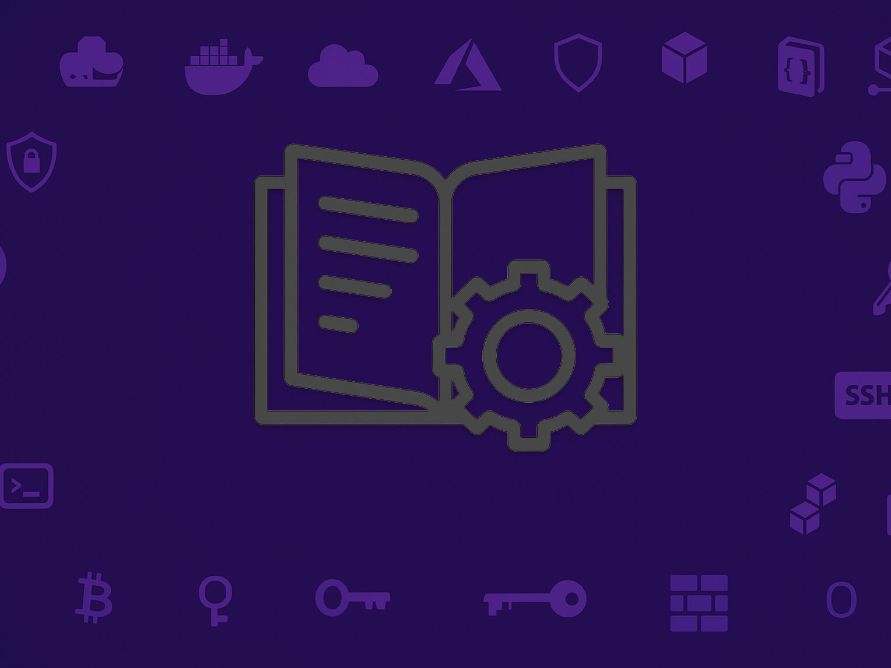

# 🧩 Puzzle-Pieces

A modular collection of setup and configuration guides for Docker, Portainer, Ubuntu, and macOS – each file is an independent piece in your infrastructure puzzle.

---

## 📦 Contents

- **[Docker Basics 🐳](#docker-basics)**  
  A compact guide to installing and managing Docker containers and images.

- **[Portainer](#portainer)**  
  Lightweight UI for managing Docker environments in the browser.

- **[Extended Docker & Ubuntu Guides 🛠️](#extended-docker--ubuntu-guides)**  
  Practical how-tos for SSH keys, unattended upgrades, and login message customization.

- **[macOS Developer Shortcuts ⌨️](#macos-developer-shortcuts)**  
  Personal hotkey collection for productivity on macOS.

---

## Docker Basics

> 👉 [docker.md](./docker.md)

This file walks through Docker installation, container management, networking, and image handling – ideal for developers and sysadmins alike.

---

## Portainer

> 👉 [portainer.md](./portainer.md)

Quick-start guide for setting up Portainer CE using Docker – a simple and effective way to control your containers via web UI.

---

## Ubuntu Guides

> - [ubuntu-install-public-keys.md](./ubuntu-install-public-keys.md) – SSH public key setup  
> - [ubuntu-auto-updated.md](./ubuntu-auto-updated.md) – Enable unattended upgrades  
> - [ubuntu-login-message.md](./ubuntu-login-message.md) – Custom MOTD with system stats  

Each file provides a focused, step-by-step walkthrough for hardening or automating your Ubuntu environment.

---

## macOS Developer Shortcuts

> 👉 [macos.md](./macos.md)

A list of personalized macOS keyboard shortcuts to streamline daily dev workflows using tools like Raycast, Arc, VSCode, and more.

⸻

🧠 Target Audience

This index is aimed at:
	•	Developers
	•	DevOps engineers
	•	Homelab enthusiasts
	•	Anyone looking to build, automate, and document a Docker-based environment – piece by piece.