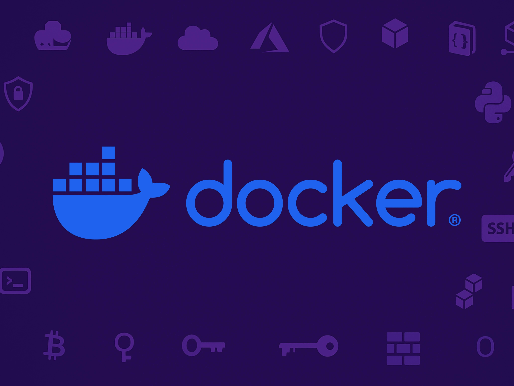

# 🐳 Docker & Portainer Guide

  

> A compact collection of setup guides for Docker and container management, including a user-friendly web interface via Portainer.

---

## 📦 Contents

- **[Docker Basics](#docker-basics)**  
- **[Portainer Installation](#portainer-installation)**  
- **[Extended Docker & Ubuntu Guides](#extended-docker--ubuntu-guides)**  
- **[macOS Developer Shortcuts](#macos-developer-shortcuts)**  

---

## Docker Basics

This guide covers the essential Docker concepts and commands:

- Install Docker on Ubuntu (3 options)
- Start & manage containers
- Work with images, volumes, and networks
- Bulk operations and debugging

👉 Full guide: [docker.md](./docker.md)

---

## Portainer Installation

Portainer is a web-based UI for managing Docker environments.  
Install it in 3 simple steps:

```bash
# 1. Create a volume for persistent data
docker volume create portainer_data

# 2. Deploy the container
docker run -d -p 8000:8000 -p 9443:9443 --name portainer --restart=always \
  -v /var/run/docker.sock:/var/run/docker.sock \
  -v portainer_data:/data \
  portainer/portainer-ce:lts

# 3. Access in browser
https://localhost:9443
```

> Source: [Portainer Documentation](https://docs.portainer.io/start/install-ce/server/docker/linux)  
👉 See [portainer.md](./portainer.md)

---

## Extended Docker & Ubuntu Guides

- 🔐 **SSH Public Key Setup**: [ubuntu-install-public-keys.md](./ubuntu-install-public-keys.md)  
- 🔄 **Enable Auto Updates**: [ubuntu-auto-updated.md](./ubuntu-auto-updated.md)  
- 🖥️ **Custom Login Message (MOTD)**: [ubuntu-login-message.md](./ubuntu-login-message.md)  

---

## macOS Developer Shortcuts

Useful hotkeys for developer workflows on macOS:

| Shortcut | Action |
|----------|--------|
| ⌘ + ⌥ + G | Open ChatGPT |
| ⌘ + ⌥ + V | Open Visual Studio |
| ⌘ + ⌥ + A | Open Arc Browser |
| ⌘ + ⌥ + C | Open Calendar |

More in [macos.md](./macos.md)

---

## 📁 Folder Structure

```text
├── assets/
│   ├── hero-docker.jpg
│   ├── hero-portaier.jpg
│   ├── hero-login-message.jpg
│   ├── hero-ubuntu-auto-update.jpg
│   ├── hero-public-key.jpg
├── docker.md
├── portainer.md
├── ubuntu-auto-updated.md
├── ubuntu-install-public-keys.md
├── ubuntu-login-message.md
├── macos.md
└── README.md
```

---

## 🧠 Target Audience

DevOps professionals, developers, homelab enthusiasts, and anyone who wants a fast and structured Docker setup.