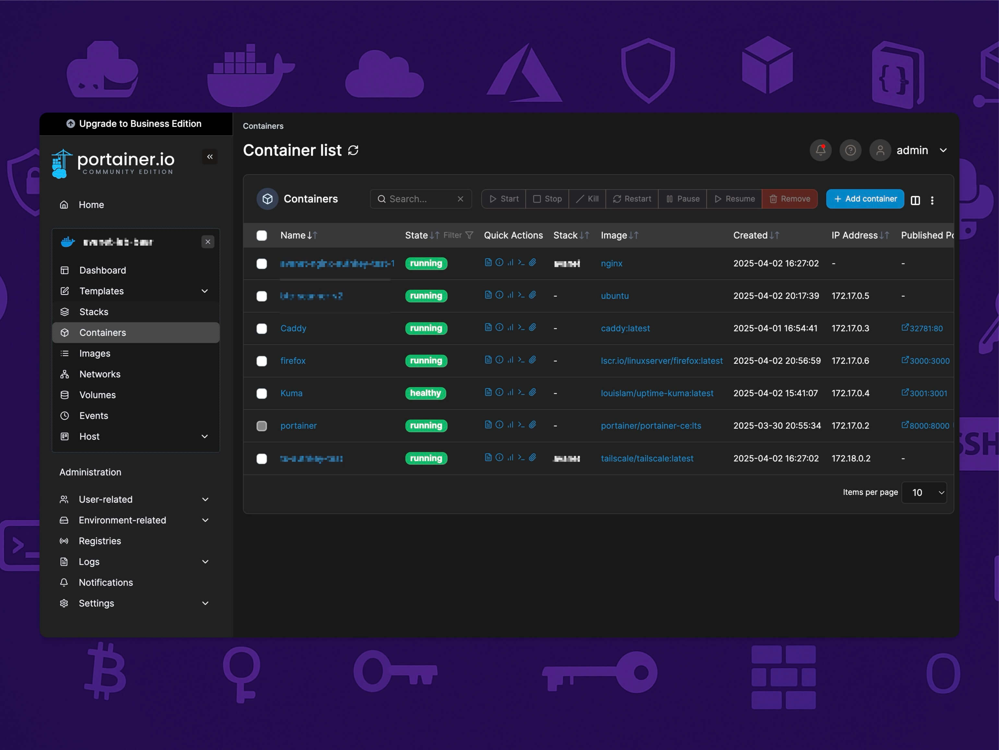

# Portainer: Simplified Docker Management

Portainer is a lightweight and user-friendly management UI for Docker environments. It simplifies the process of managing containers, images, networks, and volumes, allowing you to easily monitor and control your Docker resources through a web interface. This guide explains how to install Portainer using Docker.

---

## Step 1: Create a Volume for Portainer's Data

Portainer requires a persistent volume to store its database and configuration data. Create the volume with the following command:

```bash
sudo docker volume create portainer_data
```

---

## Step 2: Run the Portainer Container

Deploy the Portainer container with the following command. This command maps the necessary ports, mounts the Docker socket for container management, and uses the volume created in Step 1 for persistent storage.

```bash
sudo docker run -d -p 8000:8000 -p 9443:9443 --name portainer --restart=always \
  -v /var/run/docker.sock:/var/run/docker.sock \
  -v portainer_data:/data \
  portainer/portainer-ce:lts
```

---

## Step 3: Log In to Portainer

After the container starts, open your web browser and navigate to:

```
https://localhost:9443
```

You can now log in to Portainer and start managing your Docker environment with ease.

---

> Source: [Portainer Documentation](https://docs.portainer.io/start/install-ce/server/docker/linux)