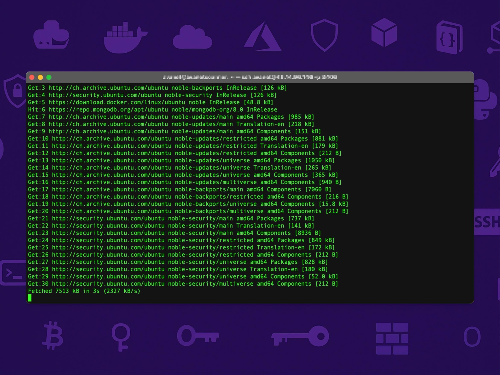

# 🔧 Step-by-Step Guide: Enable Automatic Updates

Follow these steps to install and configure automatic updates on your system.

---

## 1. Install the Package (if not already installed)

Update your package lists and install the `unattended-upgrades` package:

```bash
sudo apt update
sudo apt install unattended-upgrades
```

---

## 2. Activate Automatic Updates

Enable the automatic update feature by running the following command:

```bash
sudo dpkg-reconfigure --priority=low unattended-upgrades
```

---

## 3. Set Up the Update Schedule

Edit the configuration file to set the update schedule:

```bash
sudo nano /etc/apt/apt.conf.d/20auto-upgrades
```

Ensure the file contains the following settings:

```bash
APT::Periodic::Update-Package-Lists "1";
APT::Periodic::Download-Upgradeable-Packages "1";
APT::Periodic::AutocleanInterval "7";
APT::Periodic::Unattended-Upgrade "1";
```

These settings will:
- Update package lists daily.
- Download available upgrades daily.
- Clean old package files every 7 days.
- Run unattended upgrades daily.