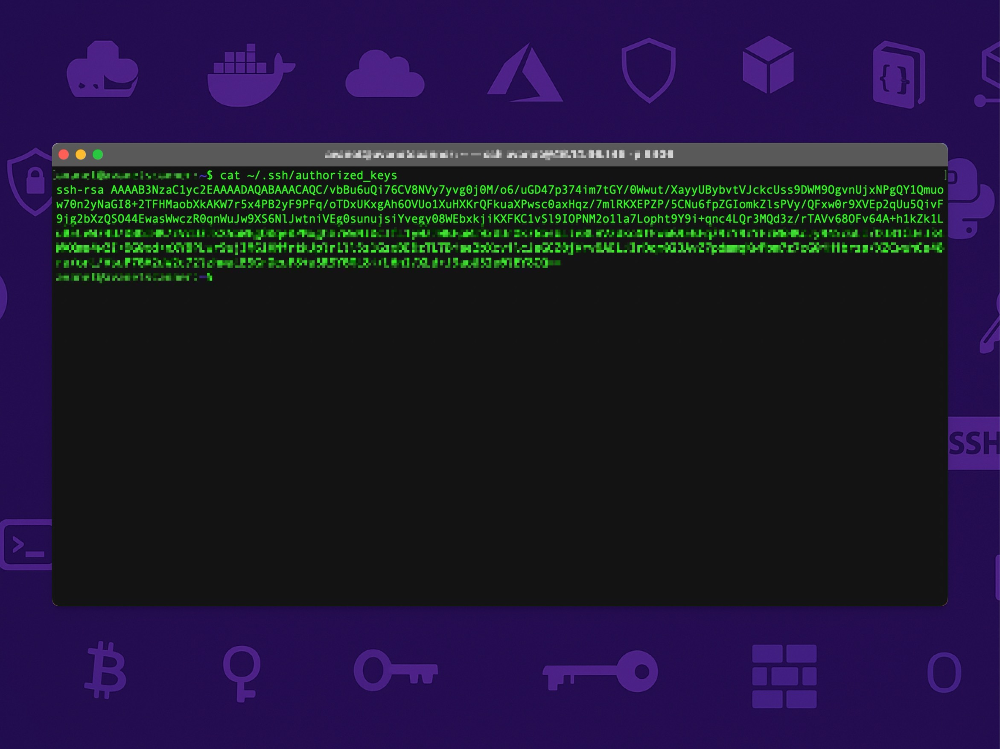

# Install Public Key

This guide helps you set up your SSH public key for secure authentication.

---

## 1. Create the .ssh Directory (if it doesn't already exist)

Create the `.ssh` directory in your home folder and set the proper permissions:

```bash
mkdir -p ~/.ssh
chmod 700 ~/.ssh
```

---

## 2. Open or Create the authorized_keys File

Open the `authorized_keys` file (or create it if it doesn't exist):

```bash
nano ~/.ssh/authorized_keys
```

Paste your previously copied public key into this file, then save by pressing **Ctrl + O**, **Enter**, and exit with **Ctrl + X**.

---

## 3. Set Correct Permissions for authorized_keys

Set the correct permissions for the `authorized_keys` file:

```bash
chmod 600 ~/.ssh/authorized_keys
```

This ensures that your authorized keys file is secure.