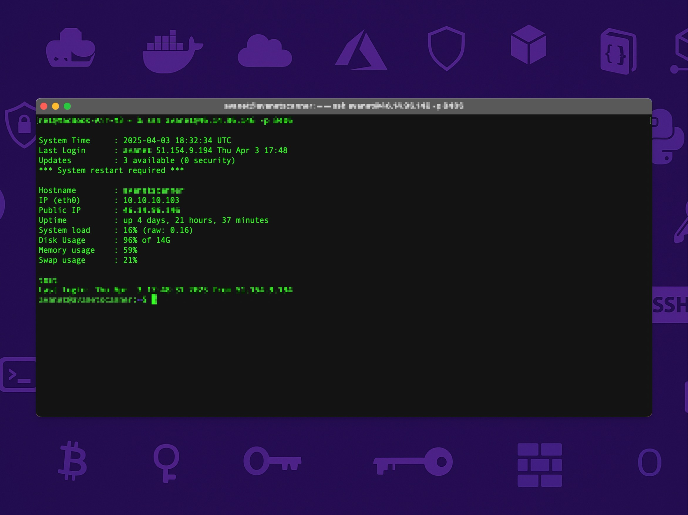

# Custom Login Message (MOTD) Setup

This guide walks you through creating a custom login message that displays useful system information. Follow the steps below:

---

## Step 1: Disable Default MOTD Scripts

The system runs multiple scripts from `/etc/update-motd.d/` to generate the login message. Disable them with this command:

```bash
sudo chmod -x /etc/update-motd.d/*
```

*This command removes execute permissions from all the default MOTD scripts, ensuring that only your custom script will run.*

---

## Step 2: Create and Edit the Custom MOTD Script

1. **Open the File for Editing**  
   Create (or open) the file that will contain your custom login message:
   ```bash
   sudo nano /etc/update-motd.d/01-minimal
   ```

2. **Paste the Following Script**  
   Insert the content below into the file. This script gathers system information and formats it into a neat summary:
   ```bash
   #!/bin/sh

   # Get the current system time and timezone
   SYS_TIME=$(date +"%Y-%m-%d %H:%M:%S %Z")

   # Get the last login (excluding current session and reboots)
   LAST_LOGIN=$(last -n 2 | grep -v 'reboot' | head -n 1 | awk '{print $1, $3, $4, $5, $6, $7}')

   # Count available updates
   UPDATES=$(apt list --upgradable 2>/dev/null | grep -v "Listing..." | wc -l)

   # Count security updates (approximate via package name)
   SEC_UPDATES=$(apt list --upgradable 2>/dev/null | grep security | wc -l)

   # Check if a system reboot is required
   REBOOT_REQUIRED=""
   [ -f /var/run/reboot-required ] && REBOOT_REQUIRED="*** System restart required ***"

   # Get local IP address of eth0
   IP_LOCAL=$(ip -4 addr show eth0 | grep -oP '(?<=inet\s)\d+(\.\d+){3}')

   # Get public IP address via external service
   IP_PUBLIC=$(curl -s https://ipinfo.io/ip)

   # Get memory usage in MB and percentage
   MEM_USED=$(free -m | awk '/Mem:/ {print $3}')
   MEM_TOTAL=$(free -m | awk '/Mem:/ {print $2}')
   MEM_PCT=$(( 100 * MEM_USED / MEM_TOTAL ))

   # Get swap usage in MB and percentage
   SWAP_USED=$(free -m | awk '/Swap:/ {print $3}')
   SWAP_TOTAL=$(free -m | awk '/Swap:/ {print $2}')
   if [ "$SWAP_TOTAL" -gt 0 ]; then
     SWAP_PCT=$(( 100 * SWAP_USED / SWAP_TOTAL ))
   else
     SWAP_PCT=0
   fi

   # Get disk usage of the root partition
   DISK_USAGE=$(df -h / | awk 'NR==2 {print $5 " of " $2}')

   # Get system load and calculate percentage based on CPU cores
   LOAD_RAW=$(cut -d ' ' -f 1 /proc/loadavg)
   CPU_CORES=$(nproc)
   LOAD_PCT=$(awk "BEGIN { printf \"%.0f\", ($LOAD_RAW / $CPU_CORES) * 100 }")

   # Display system summary
   echo ""
   echo "System Time     : $SYS_TIME"
   echo "Last Login      : $LAST_LOGIN"
   echo "Updates         : $UPDATES available ($SEC_UPDATES security)"
   [ -n "$REBOOT_REQUIRED" ] && echo "$REBOOT_REQUIRED"
   echo ""
   echo "Hostname        : $(hostname)"
   echo "IP (eth0)       : $IP_LOCAL"
   echo "Public IP       : $IP_PUBLIC"
   echo "Uptime          : $(uptime -p)"
   echo "System load     : $LOAD_PCT% (raw: $LOAD_RAW)"
   echo "Disk Usage      : $DISK_USAGE"
   echo "Memory usage    : ${MEM_PCT}%"
   echo "Swap usage      : ${SWAP_PCT}%"
   echo ""
   ```
   *After pasting, save the file by pressing `Ctrl + O`, hit `Enter`, and then exit with `Ctrl + X`.*

---

## Step 3: Make the Script Executable

Ensure the script is executable so that it runs at login:
```bash
sudo chmod +x /etc/update-motd.d/01-minimal
```

*This command grants execute permission to your custom MOTD script.*

---

Now, when you log in, your custom login message will display a summary of your system’s information.